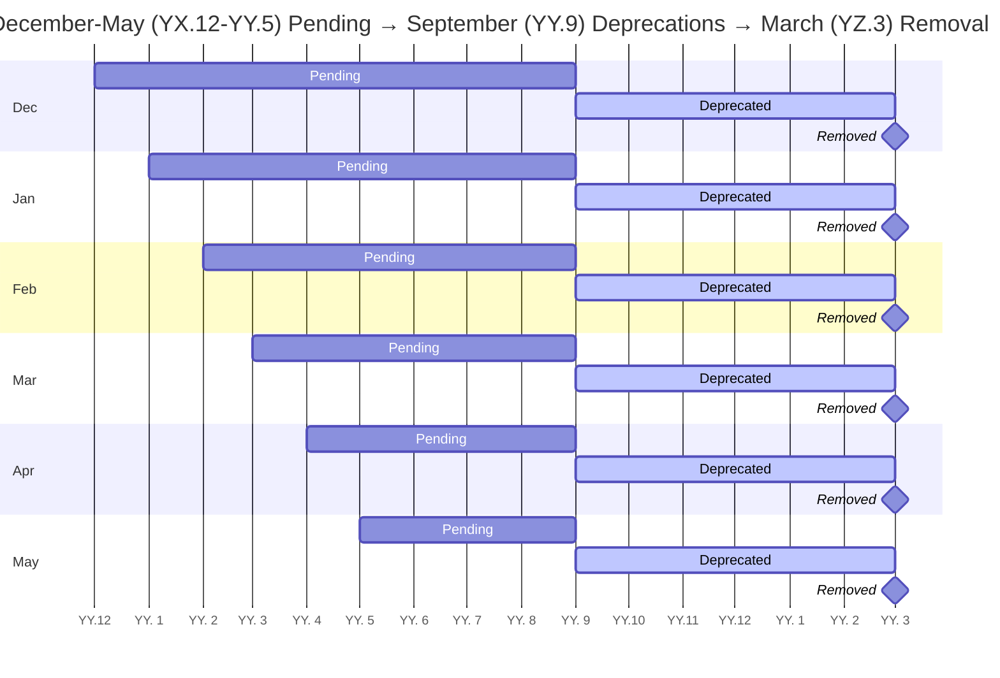

<table>
<tr><td> Title </td><td> Conda Deprecation Schedule </td>
<tr><td> Status </td><td> Accepted </td></tr>
<tr><td> Author(s) </td><td> Ken Odegard &lt;kodegard@anaconda.com&gt;, Jannis Leidel &lt;jleidel@anaconda.com&gt;, Travis Hathaway &lt;thathaway@anaconda.com&gt; </td></tr>
<tr><td> Created </td><td> May 20, 2022 </td></tr>
<tr><td> Updated </td><td> September 20, 2022 </td></tr>
<tr><td> Discussion </td><td> https://github.com/conda-incubator/ceps/pull/27 </td></tr>
<tr><td> Implementation </td><td> NA </td></tr>
</table>

<!-- links -->
[cep8]: https://github.com/conda-incubator/ceps/blob/main/cep-8.md
[django]: https://docs.djangoproject.com/en/dev/internals/release-process/#deprecation-policy
[voting]: https://github.com/conda-incubator/governance#enhancement-proposal-approval
[cep9999]: https://github.com/conda-incubator/ceps/blob/main/cep-9999.md

## Abstract

This CEP describes a deprecation schedule to properly warn about upcoming removals from the codebase. This policy expands on ideas and terminology defined in the [Conda Release Schedule (CEP-8)][cep8].

> **Note**
> This CEP is only applicable for projects that have adopted either the [Conda Release Schedule (CEP-8)][cep8] or the [Conda-build Release Schedule (CEP-9999)][cep9999].

## Specification

We propose a deprecation schedule that is slower than the [Conda Release Schedule (CEP-8)][cep8]. This is in acknowledgment of our diverse user groups (e.g. everything from per user per machine installs to multi-user installs on shared clusters).

We define a new type of release, a deprecation release, to augment regular releases. A deprecation release occurs twice every year in March and September:

| Version | Release Type |
|---|---|
| `YY.1.0` | regular |
| `YY.2.0` | optional |
| `YY.3.0` | regular, **deprecation** |
| `YY.4.0` | optional |
| `YY.5.0` | regular |
| `YY.6.0` | optional |
| `YY.7.0` | regular |
| `YY.8.0` | optional |
| `YY.9.0` | regular, **deprecation** |
| `YY.10.0` | optional |
| `YY.11.0` | regular |
| `YY.12.0` | optional |

All deprecations will need to transition through three (3) states:

1. **Pending deprecation**: when a feature is marked for future deprecation
    - Any feature can be marked as *pending deprecation* in **any release**
    - This state is also a comment period where community concerns or disputes may be raised, see [Disputing a Deprecation](#disputing-a-deprecation)
2. **Deprecated**: when a feature is marked for future removal
    - All *pending deprecations* that have been through at least two (2+) **regular release** (4-9 months after being marked as *pending deprecation*) are relabeled as *deprecated* in the next **deprecation release**
    - This state is considered final, the deprecation **will** occur, disputes are no longer possible, see [Disputing a Deprecation](#disputing-a-deprecation)
3. **Removed**: when a feature is removed from the codebase
    - All *deprecations* are removed in the next **deprecation release**

This would result in the following schedule:

Occasionally, there may be changes to the codebase that warrant a longer deprecation schedule. If that occurs, the deprecation warning will clearly specify that a deviation is occurring and what the expected schedule will be instead.

### Disputing a Deprecation

The **pending deprecation** state is also a comment period whereby disputes for the deprecation may be raised.

To raise a dispute, open an issue on the relevant repository with the following details:

1. Which **pending deprecation** feature to dispute
2. Details and explanation for why the **pending deprecation** shouldn't proceed

It's up to the repository maintainers to engage in the discussion, resolve concerns, or ultimately revert the **pending deprecation** status.

Should the dispute reach an impasse, the steering council must vote on the resolution following the [standard voting procedure of an enhancement proposal][voting].

## Motivation

This CEP will help prevent unexpected breakage of downstream tooling as the codebase evolves.

## Backwards Compatibility

This is backwards compatible and will also encourage better backwards compatibility.

## Alternatives

1. Ad hoc deprecations.
   - Unpredictable and unreliable.
2. Mark as **pending deprecation** in one release, mark as a **deprecated** in the next release, and **remove** in third release.
   - Rejected for being too rapid given the sprawling ecosystem and unknown number of downstream applications.

## Resolution

This section contains the final decision on this issue.

## Reference

- [Django's Deprecation Policy][django]

## Copyright

All CEPs are explicitly [CC0 1.0 Universal](https://creativecommons.org/publicdomain/zero/1.0/).
