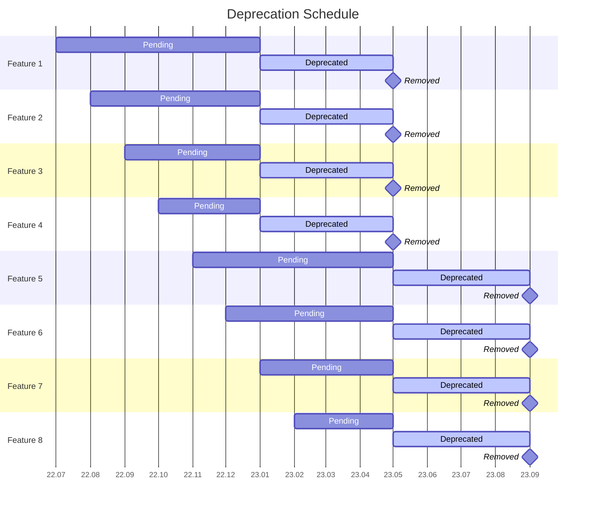

<table>
<tr><td> Title </td><td> Conda Deprecation Schedule </td>
<tr><td> Status </td><td> Draft </td></tr>
<tr><td> Author(s) </td><td> Ken Odegard &lt;kodegard@anaconda.com&gt; </td></tr>
<tr><td> Created </td><td> May 20, 2022 </td></tr>
<tr><td> Updated </td><td> July 6, 2022 </td></tr>
<tr><td> Discussion </td><td> NA </td></tr>
<tr><td> Implementation </td><td> NA </td></tr>
</table>

## Abstract

Describes a deprecation schedule to properly warn about upcoming removals from the codebase. This policy expands on ideas and terminology defined in the Conda Release Schedule (CEP-?).

## Specification

We propose a deprecation schedule that is slower than the Conda Release Schedule (CEP-?). This is in acknowledgment of our diverse user groups (e.g. everything from per user per machine installs to multi-user installs on shared clusters).

We define a new type of release, deprecation release, to augment the regular release. A deprecation release occurs three (3) times every year in January, May, and September:

| Version | Release Type |
|---|---|
| `YY.1.0` | regular, **deprecation** |
| `YY.2.0` | optional |
| `YY.3.0` | regular |
| `YY.4.0` | optional |
| `YY.5.0` | regular, **deprecation** |
| `YY.6.0` | optional |
| `YY.7.0` | regular |
| `YY.8.0` | optional |
| `YY.9.0` | regular, **deprecation** |
| `YY.10.0` | optional |
| `YY.11.0` | regular |
| `YY.12.0` | optional |

All deprecations will need to transition through 3 states:

1. **pending deprecation**: when a feature is marked for future deprecation
    - any feature can be marked as *pending deprecation* in **any release**
2. **deprecated**: when a feature is marked for future removal
    - all *pending deprecations* that have been through at least one (1+) **regular release** (3-6 months after being marked as *pending deprecation*) are relabeled as *deprecated* in the next **deprecation release**
3. **removed**: when a feature is removed from the codebase
    - all *deprecations* are removed in the next **deprecation release**

This would result in the following schedule:

Occasionally there may be code changes that warrant a longer deprecation schedule. If that occurs the deprecation warning will clearly specify that a deviation is occurring and what the expected schedule will be instead.

## Motivation

Help prevent unexpected breakage of downstream tooling as the codebase evolves.

## Backwards Compatibility

This is backwards compatible and will also encourage better backwards compatibility.

## Alternatives

1. Mark as **pending deprecation** in one release, mark as a **deprecation** the next release, and **remove** in third release.
   - Rejected for being too rapid given the sprawling ecosystem and unknown number of downstream applications.

## Resolution

This section contains the final decision on this issue.

## Reference

- [Django's Deprecation Policy](https://docs.djangoproject.com/en/dev/internals/release-process/#deprecation-policy)

## Copyright

All CEPs are explicitly [CC0 1.0 Universal](https://creativecommons.org/publicdomain/zero/1.0/).
