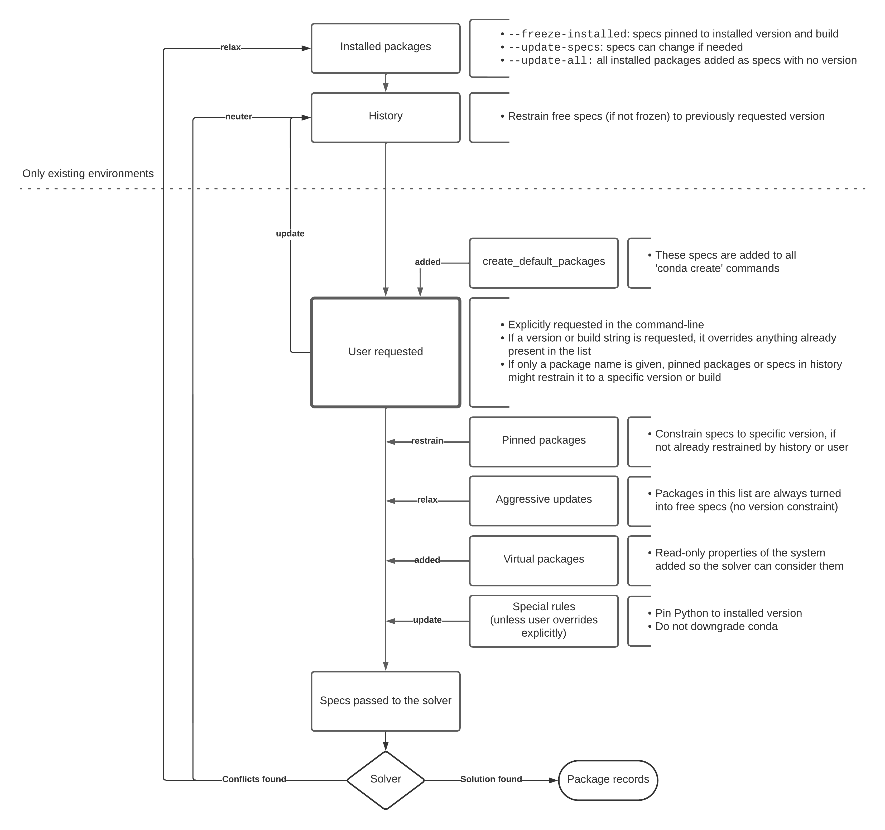

<table>
<tr><td> Title </td><td> Technical specification for creation and deletion of conda environments </td>
<tr><td> Status </td><td> Draft </td></tr>
<tr><td> Author(s) </td><td> Jaime Rodríguez-Guerra &lt;jrodriguez@quansight.com&gt;</td></tr>
<tr><td> Created </td><td> Jun 10, 2022</td></tr>
<tr><td> Updated </td><td> Jun 10, 2022</td></tr>
<tr><td> Discussion </td><td> NA </td></tr>
<tr><td> Implementation </td><td> NA </td></tr>
</table>

## Abstract

Conda environments have existed for more than 10 years. During most of that time,
`conda` was the only tool available to create, modify and delete conda environments. As a result,
once the Python implementation was considered stable enough, its integration test suite could be
regarded as the only technical specification needed for practical purposes.

However, as other tools appeared in the ecosystem (namely `mamba` and `micromamba`, along with the
`libmamba`-based solver), some of the tests contained in the integration suite did not adjust to
the ecosystem expectations (tests too strict, too tied to `conda` implementation details,
ambiguous results, conflicting outcomes across different tests, etc).

In this CEP, we'd like to propose a minimum set of guidelines any software implementation that
operates on `conda` environments should adhere to.

## Specification

The technical specification will list a set of cases where known input conditions are given, and
list the expected outcome and its rationale. It will be detailed at the command-line interface
level following conda's 4.13 implementation. However, this CEP will not try to standardize the CLI
commands, subcommands or flags. That work can be discussed in a different CEP.

### Terminology

#### Conda environment

The [conda docs][conda-docs-environments] define a `conda` environment as a "a directory that
contains a specific collection of conda packages that you have installed". However, the internal
structure of that directory is not fully specified, since it depends on the contents of the
packages installed.

The only technical requirement enforced by `conda` activation mechanisms is that the environment
must contain a `conda-meta` directory with a `history` file. Other than that, the environment can
contain anything. It must be noted, though, that there are other important locations which might be
present in the directory tree. These are optional, but have a role in the conda environment
lifecycle:

- `bin/`: added to PATH on Unix
- `lib/`: searched for dynamic libraries on Unix
- `Scripts/`, `Library/bin`: added to PATH on Windows
- `etc/conda/activate.d`, `etc/conda/deactivate.d`: searched for activation and deactivation
  scripts, respectively

#### Package record

Also known as a repodata record. A collection of metadata that refer to a concrete and specific
instance of a package artifact, usually a `.tar.bz2` or a `.conda` file. The conda channels list
package records in their `repodata.json` files. Check the [repodata record schema][repodata-record]
and the [`PackageRecord` classes][packagerecord] for more details.

The most important fields are:

* `name`, `version` and `build`: these three strings are used to fully identify the package record.
* `depends`: list of match specifications the package record requires in order to run.
* `constrains`: list of match specifications that impose restraints on non-required packages
  installed in the same environment.
* `track_features`: list of arbitrary strings used to de-prioritize variants of a package record
  (the more items in this list, the more de-prioritized the package record gets).
* `sha256`: unique hash of the file.
* `subdir`: platform this package has been built for (including `noarch`).

The `PackageRecord` class has two subclasses:
* `PackageCacheRecord`, which represents the metadata of a package already in downloaded to cache,
  (extracted or not).
* `PrefixRecord`, which represents the metadata of a package already linked in an environment.

#### Match specification

Also known as _match spec_. A domain-specific language to query conda channels for one or more
package records. There's no implementation agnostic specification available, so the best resource
so far is [conda's `MatchSpec` class][matchspec-class].

#### Environment file

A YAML file that defines a list of match specs that will be used to create or update a conda
environment. It can optionally list channels and the name of the environment to be created.
Interestingly, it also supports some `pip` interfacing: the file can detail which PyPI packages
should be installed in the environment too.

#### Lock file

A file that defines a list of package records so a conda environment can be created
deterministically, without using match specs (which requires invoking a solver). There are two types
of lock files in the conda ecosystem:

- Unified lock file: A YAML file generated by conda-lock, with multi-platform support.
- Explicit lock file: Legacy format that employs a TXT file to list packages via their URLs and
  hashes. It can only express the requirements for a single platform.

#### History file

A plain-text file with a diff-like syntax that collects the match specifications used to modify
a conda environment during its lifetime. It's always located under `conda-meta/history`.

#### Pinning

Conda environments can mark some of the installed packages as "pinned", meaning that their version
changes are constrained in some way. To do so, a plain text file can list the packages and their
restraints in a `conda-meta/pinned` file. Pinnings can be overriden under certain circumstances.

<!------------------------------------>
<!-- Creation of conda environments -->
<!------------------------------------>

### Managing conda environments

A conda environment is usually populated by linking or unpacking the contents of conda packages. As
a result, the input data is a list of package records that need to be extracted and linked.
However, the user rarely specifies the list of package records directly. Instead, they usually ask
for a list of match specs, which is then turned into a list of package records by the tool. Once
a list of package records is available, the tool can proceed to download, extract, link and run all
the post-creation tasks.

#### From match specifications to package records

This is the most common way of interacting with conda environments. The user will provide a list
of match specifications and the tool will have to process that query to provide a list of package
records; usually by relying on a solver.

> 
>
> Figure 1. Diagram of the specs preparation logic in conda. Read from top to bottom.

##### Default behaviour (no flags)

1. When a match specification is requested, the tool must be able to choose the most adequate
   package records for the requested package and its full dependency tree.
1. Package records can also include a `constrains` list. The solution needs to account for the
   relevant ones.
1. The solution of package records need to be optimized for the following criteria:
    * Prefer packages from channels higher in priority
    * Maximize their versions and build numbers
    * Minimize the number of `track_features` items
    * Prefer _arch_-specific packages over `noarch`
    * Maximize the timestamps, if needed
    * Minimize the total number of packages needed
    <!-- ^ JRG: conda.resolve optimizes for `features` and other variables, but I left
                those out because they are deprecated
    -->
1. The [`MatchSpec` syntax][matchspec-class] can be used to further constrain the packages that can
   be considered candidates for the solution.
1. If a match specification includes a channel, the corresponding package record must come from
   that channel.
   <!-- ^ JRG: What about their dependencies? I guess it's "unspecified"? -->
1. The explicitly requested match specifications must be recorded in `conda-meta/history`.
1. In already existing environments, solutions that minimize the number of changes to the installed
   packages are preferred by default. Conda's implementation achieves this by:
    * Freezing installed packages to their current version, removing the version constraint if it
      results in a conflict, unless the package is part of history.
    * Adding the match specifications annotated in `conda-meta/history`, if not present already in
      the list of specs explicitly requested by the user. In other words, the specs recorded in
      history will always be added to the list of match specifications passed to the solver, unless
      the user overrides it explicitly with a new match specification that is not name-only.
    * Minimizing the package record changes in the solver.
1. If a package is marked as "pinned", the solver will use that constraint unless overriden in
   certain cases:
    * If the user explicitly requests a match specification that conflicts with the pinned spec, the
      user-specified match specification is used.
    * If the user explicitly requests a match specification with a compatible, more restrictive
      constraint, the pinned constraint is used.
    * If a name-only match specification is explicitly requested by the user and that match
      specification is recorded in history, the history expression is used instead. If it is not
      part of history, the pinned expression is used.
1. Package names included in the "aggressive update list" are always added to the list of match
   specifications if they are present in the environment. In other words, once installed, the solver
   will always try to update them and will never try to freeze them.
1. If Python is present in the environment, the solver will always pin it to its installed version
   with a `<major>.<minor>.*` expression. This can be overriden by the user with an explicit match
   specification that requests a different version.
   <!-- conda may treat match specs like `numpy=*=py36` as explicit requests of Python version
        changes, but imo this should not be supported.
   -->
1. If `conda` is present in the environment, the solver must not provide a solution that results in
   a version downgrade, unless explicitly asked by the user.
1. For new environments, packages listed under `create_default_packages` are added to the list of
   match specs as if they had been added explicitly by the user. If the user already specified one
   or more of those packages, user-specified specs take precedence.

##### Subcommand-depending behaviour

1. The default behaviour detailed above is followed by `create` (new environments only) and
  `install` (new and existing environments).
1. The `update` subcommand has some particularities:
    * It can only operate on existing environments
    * It only accepts name-only specifications
    * It will always try to install the latest version available for the specified package name, if
      allowed by constraints of the environment. To do so, already installed packages might be
      updated. In constrast, `install` will not change an installed package if it already satisfies
      the requirements of the environment.
      <!-- JRG: Docs do mention this, but I can't find where this is actually implemented, so
                I don't think it's really a thing... We might need tests.
      -->

##### Flag-depending behaviour

Flags that skip the solver:

* `-S`, `--satisfied-skip-solver`: Exit early if the requested specs are satisfied by the current
  environment. This disables the aggressive update checks too.

Flags that modify the list of match specifications passed to the solver:

* `--update-specs`: Allow updates in the environment only as necessary.
* `--update-deps`: All dependencies of explicitly requested packages will be explicitly added to the
  list of match specifications as "name-only" (no version restraint), with the exception of the
  pinned packages and `python` (which is pinned to the installed version). Note this requires an
  additional solving step.
* `--freeze-installed`, `--no-update-deps`: Packages already present in the environment will be
  included in the list of match specifications, pinned to their respective installed versions if not
  directly specified by the user already.
* `--update-all`: All installed packages are added to the list of match specifications, with no
  version restraint, if not directly specified by the user already. Records matching in history will
  use the historic spec.
* `--no-pin`: Packages marked as pinned will no longer receive any special treatment.
* `--no-default-packages`: Do not add the packages configured as `create_default_packages`.

> Note: When no flags are used, `conda install` and `conda remove` will try to solve the request
> with `--freeze-installed` first. If not solvable, then it will default to `--update-specs`. If
> you want to disable this behaviour, pass `--update-specs`. `conda update` doesn't freeze by
> default (uses `--update-specs` instead).

Flags that affect the returned solution only change the list of package records returned by the
solver:
* `--no-deps`: post-solve flag that will filter out the dependencies of the explicitly requested
  packages, leaving them unchanged in the environment if applicable.
* `--only-deps`: post-solve flag that will filter out the explicitly requested packages from the
  final solution, installing only the dependencies added by these, if applicable.
* `--prune`: post-solve flag that will remove packages from the environment if they are not part
  of the solution returned by the solver (orphan nodes).

### Specifics for the removal of conda packages

The `conda remove` subcommand is not very different from `conda update`. The solver is still
involved by default, and most of the same principles apply.

1. Only package names are accepted in the CLI.
1. The environment should change as little as possible. This means:
    * `--freeze-installed` is enabled by default. If the first attempt didn't succeed, then a
      relaxed solve is used instead.
    * History and pinned packages are still used while compiling the list of match specifications.
1. There are some flag-depending behaviors:
    * `--no-pin` ignore the pinned packages during the solve step.
    * `--force` skips the solving steps. Instead it will just uninstall the package record that
      matches the package name passed.
    * `--all` will remove all packages in the environment, and then remove the environment. This
      mode doesn't involve the solver either.

#### From package records to conda environment

Once the solver has computed the list of package records that need to be present in the environment,
`conda` will apply a set of actions, collected together under a `Transaction` object that knows how
to apply the actions but also how to undo the action if an error occurred, and cleanup after it's
finished (either successfully or not).

These actions are implemented with this API:

```python
class Action:
    def verify(self):
        "Run checks to assess if the action can proceed"
    def execute(self):
        "Perform the action"
    def reverse(self):
        "Undo execute"
    def cleanup(self):
        "Remove artifacts from verification, execution or reversal"
    @property
    def verified(self):
        "True if verification was run and successful"
```

1. Download the package record from the specified channel, if not present in the tarball cache
1. Extract the corresponding tarball, if not already extracted to the package cache
1. Run the verification tasks of all actions. The most important check is to ensure that the files
   listed in the package manifest can be found in the package cache.
1. If the environment location did not exist already, it needs to be created.
1. If there are packages to be removed, for each of them:
    1. Remove menu shortcuts, if any
    1. Run deactivation and pre-unlink scripts, if any
    1. Unlink or remove files, including the `.pyc` artifacts
    1. Run post-unlink scripts, if any
    1. Remove the executables created by their entry points
    1. Remove the package metadata JSON file in `conda-meta`
    1. Update `conda-meta/history`
1. In the event that all packages are removed and none added, the environment is deemed empty. In
   these cases, the environment will be deleted and unregistered.
1. If there are packages to be added, for each of them:
    1. Run pre-link scripts, if any
    1. Link and / or replace hardcoded paths + copy files
    1. Create the executables as indicated by the entry points
    1. Run activation and post-link scripts, if any
    1. Compile the bytecode for all Python modules
    1. Create the relevant menu shortcuts, if any
    1. Annotate the package metadata as a JSON file in `conda-meta`
    1. Update `conda-meta/history`
1. If the environment was only now created, register it

##### Registration of conda environments

The location of all known conda environments are listed in `~/.conda/environments.txt`. Each line in
this file corresponds to a known location. If an environment is deleted, its location must be
removed from this file too.

Temporary environments created by `conda-build` and other tools must not be included.

##### Registration of conda package contents in an environment

The files of all packages linked in an environment need to be registered in the `conda-meta`
subdirectory. Each package will create a JSON file, named after the tarball file name, listing the
contents that were used to populate the environment. This JSON file does not have a schema yet; the
best reference available is the [`PrefixRecord`][prefixrecord] class in `conda.models.records`.

## References

* [Conda concepts: environmnets][conda-docs-environments]
* [Schema for repodata records][repodata-record]
* [`MatchSpec` class][matchspec-class]
* [`PackageRecord` class][packagerecord]
* [`PrefixRecord` class][prefixrecord]

## Copyright

All CEPs are explicitly [CC0 1.0 Universal](https://creativecommons.org/publicdomain/zero/1.0/).

[conda-docs-environments]: https://docs.conda.io/projects/conda/en/latest/user-guide/concepts/environments.html
[repodata-record]: https://github.com/conda/schemas/blob/master/repodata-record-1.schema.json
[matchspec-class]: https://github.com/conda/conda/blob/4.13.0/conda/models/match_spec.py#L69
[prefixrecord]: https://github.com/conda/conda/blob/4.13.0/conda/models/records.py#L440
[packagerecord]: https://github.com/conda/conda/blob/4.13.0/conda/models/records.py#L242
